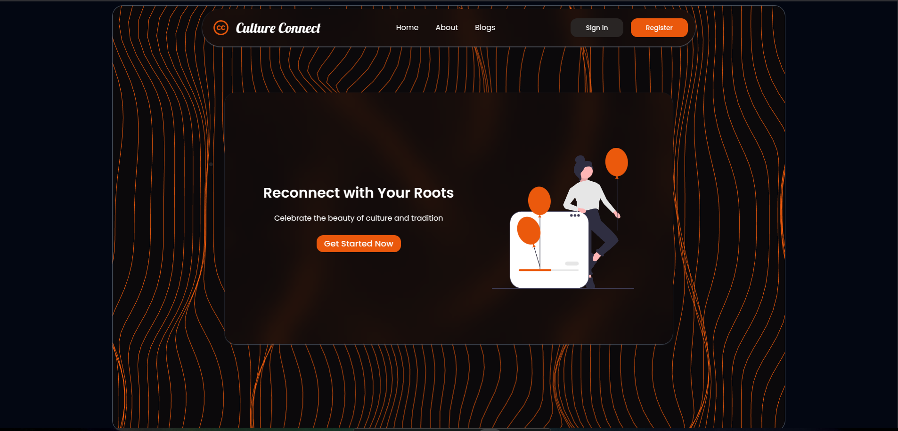
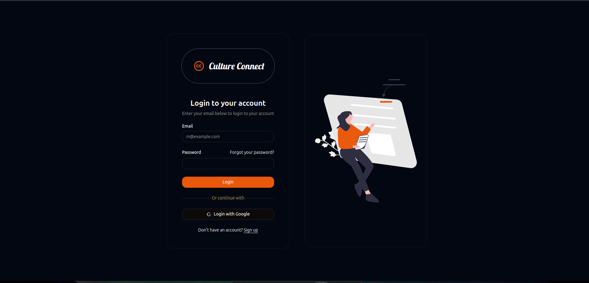

**Culture Connect**
=====================

Culture Connect is a modern, full‑stack web application designed to bring people together through shared cultural experiences. Built as a Single‑Page Application with React and Vite, it leverages Firebase Authentication for secure sign‑up/sign‑in, Firestore for real‑time data storage of user‑generated posts and events, and Cloudinary for efficient image uploads. Users can create and discover culture‑focused posts, filter by tags or location, like and bookmark favorites, and receive event notifications. An integrated feedback form—powered by EmailJS—lets visitors send suggestions directly from the frontend, while admin users have elevated controls for content moderation.

**Table of Contents**
-----------------

* [Installation](#installation)
* [Configuration](#configuration)
* [Features](#features)
	+ [Authentication](#authentication)
	+ [Posts & Like/Unlike](#posts--likeunlike)
	+ [Search and Filter](#search-and-filter)
	+ [Notifications](#notifications)
	+ [Admin Authority](#admin-authority)
	+ [Feedback Form](#feedback-form)
* [Screenshots](#screenshots)
* [Demo Video](#demo-video)
* [Usage](#usage)
* [License](#license)

**Installation**
------------

### Clone the repository

```bash
git clone https://github.com/yourusername/your-repo.git
cd your-repo
```

### Install dependencies

```bash
npm install
# or
yarn install
```

### Setup Environment Variables

Create a `.env` file in the root of your project with the following keys (update with your actual values):

```env
VITE_FIREBASE_API_KEY=your_firebase_api_key
VITE_FIREBASE_AUTH_DOMAIN=your_firebase_auth_domain
VITE_FIREBASE_PROJECT_ID=your_firebase_project_id
VITE_FIREBASE_STORAGE_BUCKET=your_firebase_storage_bucket
VITE_FIREBASE_MESSAGING_SENDER_ID=your_firebase_messaging_sender_id
VITE_FIREBASE_APP_ID=your_firebase_app_id

VITE_CLOUD_NAME=your_cloudinary_cloud_name
VITE_UPLOAD_PRESET=your_cloudinary_upload_preset

VITE_ADMIN_EMAIL=xyz@gmail.com

VITE_EMAILJS_SERVICE_ID=your_emailjs_service_id
VITE_EMAILJS_TEMPLATE_ID=your_emailjs_template_id
VITE_EMAILJS_USER_ID=your_emailjs_user_id
```

*Note:* Restart your development server after modifying the `.env` file.

### Firebase & Cloudinary Setup

* Configure your Firebase project in the Firebase console.
* Set up Cloudinary with an unsigned upload preset.
* (If using EmailJS) Configure your account and obtain your service, template, and user IDs.

**Configuration**
--------------

The project is configured using environment variables (as shown above) and utilizes:

* **Firebase:** For user authentication and Firestore.
* **Cloudinary:** For image uploads.
* **EmailJS (or alternative):** For sending feedback emails directly from the frontend.

**Features**
------------

### Authentication

* Users can sign up with a username, email, and password.
* After signing up, users can log in via email/password or Google (if configured).
* Firebase Authentication handles the session, and the user's UID is accessible via `auth.currentUser.uid`.

### Posts & Like/Unlike

* **Creating Posts:** Users can create posts with a title, description, image, tags, date, time, address, and pincode.
* **Like/Unlike:** Users can like or unlike posts. The like/unlike functionality is implemented with optimistic UI updates.
* **Local Filtering:** Posts can be filtered based on location (pincode range).
* **Tag Filtering:** Top 4 tags (based on occurrence) are computed and rendered as filter buttons.

### Search and Filter

* **Search Bar:** A search form allows filtering posts by title and tags.
* **All Posts Button:** Resets search filters to show all posts.
* **Suggestion Button:** Displays posts from authors whose posts the user has liked.
* **Local Posts Button:** Filters posts within a pincode range (current user's pincode ± 10).

### Notifications

* **Event Reminders:** The app checks for posts (events) the user liked that are happening on the current day, displaying a notification banner.
* **Auto-Cleanup:** Outdated notifications (events passed) are cleared from the user's liked list automatically.

### Admin Authority

* If the logged-in user’s email matches the admin email (set in the environment), additional admin controls (e.g., Delete Post) are visible.
* Admins can delete any post directly from the dashboard.

### Feedback Form

* A feedback form on the Home page collects the user's name, email, and message.
* On submission, the form sends an email to the admin using EmailJS (or your preferred email service).

**Screenshots**
-------------

*Below are some sample screenshots. Replace the image paths with your actual screenshots.*

### Dashboard

---

---

---

---

---

---

---

---

---

**Demo Video**
-------------


  https://youtu.be/abQzgB938_4?si=CEnvohNGzUwNiQdc

**Usage**
-----

1. **Start the development server:**

   ```bash
   npm start
   # or
   yarn start
   ```

2. **Access the App:**

   Open your browser and navigate to `http://localhost:3000`.

3. **Test Features:**

   * **Authentication:** Sign up and log in.
   * **Posts:** Create posts, like/unlike, search, and filter.
   * **Admin Controls:** Log in with the admin email (`xyz@gmail.com`) to see delete buttons.
   * **Feedback:** Submit feedback via the Home page feedback form.

**License**
-------

This project is licensed under the MIT License. See the [LICENSE](LICENSE) file for details.
